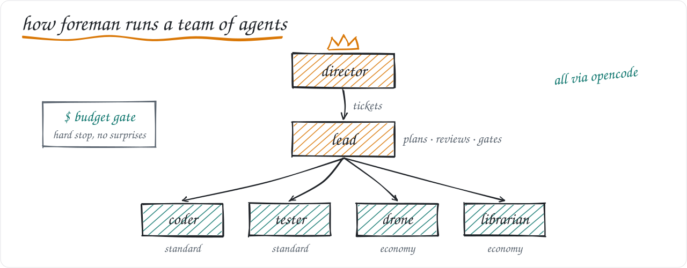

**Distributed Systems**:
- [Distributed-API-Rate-Limiter]: Go and Redis sliding window rate limiter for high throughput APIs. (2026)

**Payments and Backend**:
- [Fault-Tolerant-Payment-Ledger]: ACID payment ledger in Java and Spring Boot with optimistic locking. (2026)
- [E-Commerce-Stripe-Webhooks-Engine]: Stripe webhook engine in Node.js that syncs payments to database. (2026)

**AI and Agents**:
- [foreman]: Orchestrates a tiered team of AI coding agents under hard budgets. (2026)
- [multi-agent-coding-tool]: Multi agent tool that plans, codes and deploys. (2026)
- [data-highway]: ML based query runtime optimizer. (2025)

**Tools**:
- [margin-notes-for-pdf]: Browser extension for PDFs with per page notes and stylus handwriting. (2026)

[Distributed-API-Rate-Limiter]: https://github.com/mastaan66/Distributed-API-Rate-Limiter
[Fault-Tolerant-Payment-Ledger]: https://github.com/mastaan66/Fault-Tolerant-Payment-Ledger
[E-Commerce-Stripe-Webhooks-Engine]: https://github.com/mastaan66/E-Commerce-Stripe-Webhooks-Engine
[foreman]: https://github.com/mastaan66/foreman
[multi-agent-coding-tool]: https://github.com/mastaan66/multi-agent-coding-tool
[data-highway]: https://github.com/mastaan66/data-highway
[margin-notes-for-pdf]: https://github.com/mastaan66/margin-notes-for-pdf
